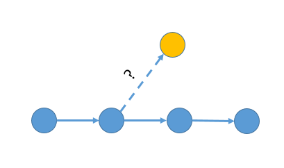

#Git-Find-Forkpoint

A bash script for finding the most similar commit among a range of commits, to a given commit.

Adi Levin,
1/29/2016
##Motivation

Suppose you have a version of your project, which was forked from your git
repository in the past, and you want to find the fork point in the git tree.

The script *find-fork-point.sh*, will go over a range of commits, measure
the amount of differences between each commit and the reference commit,
and find the most similar commit.

##Usage

Go to your repository folder, and start a git bash. The type:

    find-fork-point <commit range> <commit>

##Examples

Using commit hashes to indicate range of commits:

    find-fork-point 1cb1d..e172 d67e    

Using branch names to indicate range of commits:

    find-fork-point master~65..master mybranch

Using just a branch name to indicate all commits that are ancestors:

    find-fork-point master mybranch

##Example with output

    find-fork-point.sh master~25..master~15 head

Output:

    Info: Found 10 commits in the range master~25..master~15

    44f7 differs from head by 216 lines
    aaab differs from head by 200 lines
    a780 differs from head by 116 lines
    fbe0 differs from head by 59 lines
    3236 differs from head by 132 lines
    9971 differs from head by 632 lines
    008c differs from head by 839 lines
    a6d3 differs from head by 589 lines
    a1ca differs from head by 691 lines
    ed61 differs from head by 737 lines

    Most similar commit to head is fbe00eee1af35be8e0ecac25c3a9f59d6959c2a6
